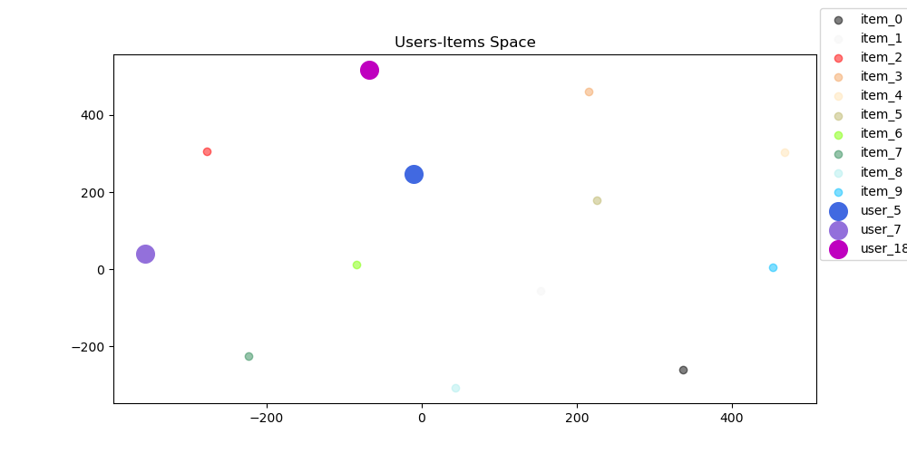

# Metadata User & Item Embeddings - Hybrid Recomender System
In this project, we implement the main algorithm of [M Kula 2015](https://arxiv.org/pdf/1507.08439.pdf) and compare findings with LightFM library, as a sanity check.

Using a Starbucks offers transactions dataset, we firstly transform data to:
- Users' features from several binned features of Starbucks customers
- Items' features from several binned features of Starbucks offers
- Binary transaction Data from Starbucks completed-declined offers

After splitting data to train and test transaction datasets, we train and predict recommendations for all test users, using 
MetadataEmbeddings algorithm and LightFM library, and compare results.

## Dependencies
* Install anaconda3

* Activate virtual enviroment
```angular2
sudo pip install --upgrade virtualenv
mkdir venvs
virtualenv my_venv
source my_venv/bin/activate
```

* Install python libraries
```angular2
pip install -r requirements.txt
```

## Data

### Download Starbucks data
- Download data from [starbucks-data](https://www.kaggle.com/datasets/ihormuliar/starbucks-customer-data) or
```js
kaggle datasets download -d ihormuliar/starbucks-customer-data
unzip starbucks-customer-data.zip
```
- Copy all files to `data` folder of this project

### Data Explanation

- porfolio: This dataset contains unique offers that were promoted to customers. Here, every offer is described by its properties.
- profile: This dataset contains unique Customer ids. Here, every customer is described by its properties.
- transcript: This dataset contains events occurred for several customers. In this exercise, we are interested on events that customer interacted with some offers.


## Processes

### Preprocess (`src/preprocessing.py`)
This script reads dataset, creates and stores all aforementioned features, and train-test datasets.
```js
cd src/
python  preprocessing.py
```

### Evaluation (`src/evaluate.py`)
This script reads the preprocessed datasets and feeds in corresponding data to LightFM model and MetadataEmbeddings model.
```js
cd src/
python3 evaluate.py
```
Next, we report MAP@3 evaluated on test dataset for both models.
As we can see both metrics are similar, and the same holds for the recommended product-offers.

Results for test sample

|         | MAP@3 |
|---------|-------|
| LightFM | 0.362 |
| MetadataEmbeddings   | 0.361 |

- LightFM first 10 users-items recommendations: 

```js
[1, 7, 6, 8, 2, 4, 0, 5, 3, 9]
[1, 9, 2, 7, 6, 4, 0, 5, 3, 8]
[1, 7, 2, 4, 0, 8, 6, 5, 3, 9]
[1, 9, 8, 6, 4, 5, 3, 0, 2, 7]
[1, 9, 6, 8, 2, 7, 4, 0, 5, 3]
[1, 9, 2, 8, 7, 4, 0, 5, 3, 6]
[9, 1, 7, 6, 8, 2, 5, 3, 0, 4]
[1, 9, 2, 4, 0, 8, 6, 5, 3, 7]
[9, 7, 2, 8, 6, 0, 4, 5, 3, 1]
[9, 1, 7, 2, 8, 6, 4, 5, 3, 0]
```

- MetaDataEmbeddings first 10 users-items recommendations:

```js
[1, 6, 7, 4, 0, 8, 2, 3, 5, 9]
[1, 9, 6, 7, 4, 0, 2, 3, 5, 8]
[1, 6, 7, 4, 8, 0, 2, 3, 5, 9]
[1, 9, 6, 8, 4, 3, 5, 0, 2, 7]
[1, 9, 6, 8, 2, 7, 4, 0, 3, 5]
[1, 9, 8, 2, 7, 4, 0, 3, 5, 6]
[1, 6, 9, 7, 8, 2, 3, 5, 0, 4]
[1, 9, 6, 4, 8, 0, 2, 3, 5, 7]
[9, 6, 7, 4, 0, 8, 2, 3, 5, 1]
[1, 9, 6, 7, 4, 8, 2, 3, 5, 0]
```

Finally, we visualize the Items space implied by Items embeddings, along with 3 users that had 2 transactions on train dataset.
In order to visualize our features against our target variables, and evaluate the explanatory power of our features, we perform a TSNE dimensionality reduction algorithm. Thus, we project all feature embedding, to a 2-D space
```angular2html
User 5, had bought items [0 9]. Top 2 recos are: [1, 6]
User 7, had bought items [8 9]. Top 2 recos are: [1, 6]
User 18, had bought items [0 4]. Top 2 recos are: [1, 9]
```

